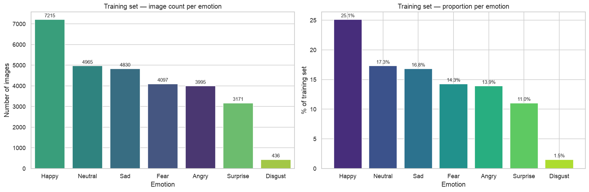
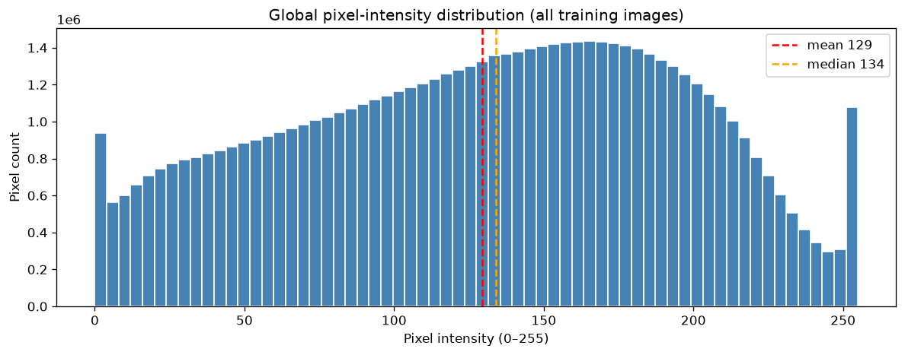
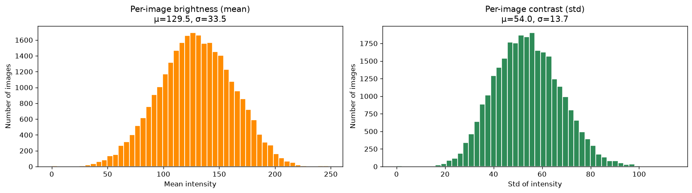
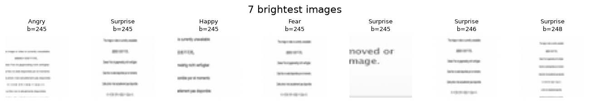
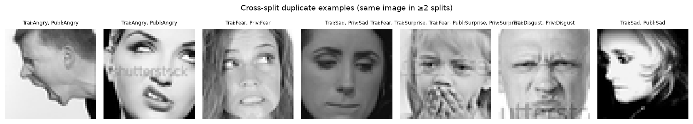
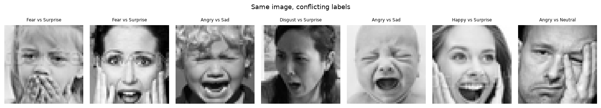
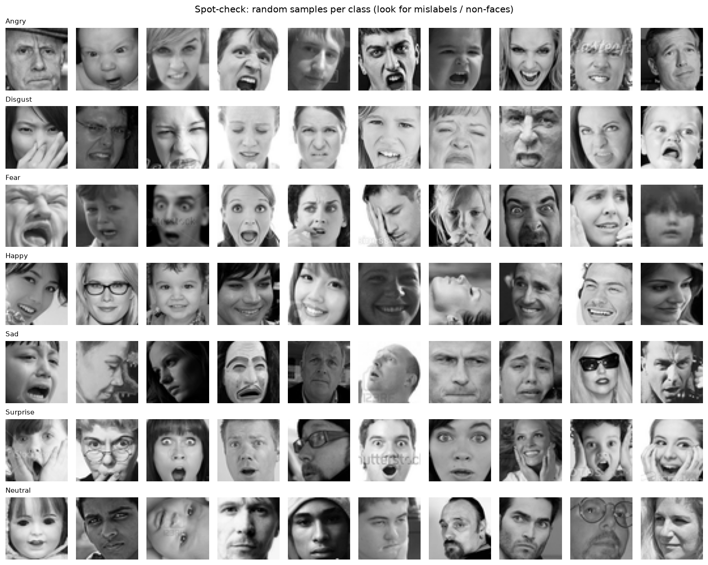
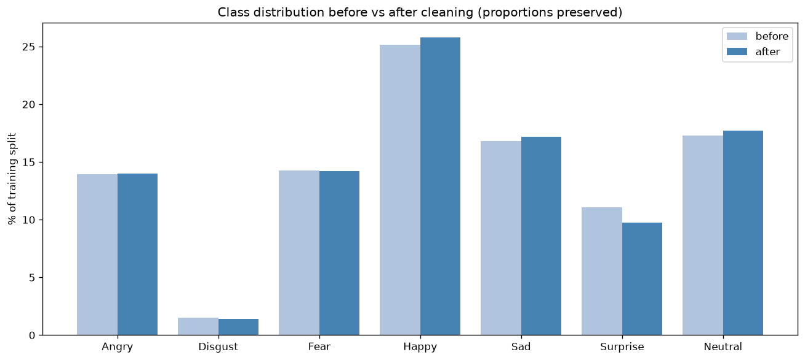

# Data

This file is the **living data record** for the Emotions Detecto project.
It documents *why* every data decision was made; `config.yaml` records *what* value is currently active.
Keep both in sync whenever the pipeline or dataset understanding changes.

---

## 1. Raw data

### 1.1 Source and provenance

**Dataset:** FER-2013 (Facial Expression Recognition 2013)
**Origin:** Introduced at ICML 2013 by Goodfellow et al. Images were gathered automatically via the Google Images API using emotion-related search queries; face regions were then cropped and aligned using the OpenCV Haar cascade detector.
**Download:** `https://assets.01-edu.org/ai-branch/project3/emotions-detector.zip`
(managed by `Fer2013Downloader`; see `config.yaml → data.url`)

The zip extracts to (verified in EDA §2.5):

| File | Columns | Role |
|---|---|---|
| `icml_face_data.csv` | `emotion`, `usage`, `pixels` | **Primary CSV** — all 35,887 rows *with* the `Usage` split column |
| `train.csv` | `emotion`, `pixels` | Flat training rows (28,709) — no split column |
| `test.csv` | `pixels` | Unlabelled test rows (no `emotion` column) — not used |
| `test_with_emotions.csv` | `emotion`, `pixels` | Labelled held-out test (7,178 = PublicTest + PrivateTest) |
| `fer2013.tar.gz` | → `fer2013/fer2013.csv` | Same schema as `icml_face_data.csv` |

This pipeline uses **`icml_face_data.csv`** as the primary file — it is the only top-level CSV carrying the `Usage` column, so it alone can separate Training / PublicTest / PrivateTest (see `config.yaml → data.primary_csv`). `test_with_emotions.csv` is reserved for the single final evaluation pass (`config.yaml → data.test_csv`).

---

### 1.2 Size and splits

`icml_face_data.csv` contains **35,887 labelled samples** distributed across three named splits via the `Usage` column (80 / 10 / 10):

| Split | `Usage` value | Count | Purpose |
|---|---|---|---|
| Training | `"Training"` | 28,709 | Model training |
| Validation | `"PublicTest"` | 3,589 | Hyperparameter tuning / early stopping |
| Test | `"PrivateTest"` | 3,589 | Held-out (not used during training) |

`test_with_emotions.csv` provides **7,178 labelled samples** (the PublicTest + PrivateTest rows combined) as an independent evaluation set.

---

### 1.3 Image format

Every sample is a **48 × 48 pixel grayscale face image** (2 304 intensity values per image, range 0–255).
Images were automatically aligned so the face region fills the frame; alignment quality varies.

The images are **not stored as files** — each row of the CSV encodes one image as a single `pixels` column: a space-separated string of 2 304 unsigned 8-bit integers in **row-major (C) order**:

```
pixels = "128 201 45 ... 99"   # 2304 values: row 0 left→right, then row 1, ...
```

Parsing:
```python
np.fromstring(row["pixels"], sep=" ", dtype=np.uint8).reshape(48, 48)
```

This is the entire input signal. There are no bounding boxes, landmarks, or metadata beyond the label and split identifier.

---

### 1.4 Label space

The `emotion` column is an integer in **0–6** mapping to seven mutually exclusive classes:

| Code | Label | Notes |
|---|---|---|
| 0 | Angry | |
| 1 | Disgust | Smallest class (~1.5 % of training data) |
| 2 | Fear | |
| 3 | Happy | Largest class (~25 % of training data) |
| 4 | Sad | |
| 5 | Surprise | |
| 6 | Neutral | |

The mapping is fixed and does not depend on any config value (`config.yaml → model.num_classes: 7`).

---

### 1.5 The pixels → emotion relationship

Each row encodes one supervised learning example:

```
(pixels string)  →  (emotion integer)
   X (input)            y (label)
```

We frame this as **multi-class image classification**: given a 48 × 48 grayscale pixel grid, predict which of the 7 emotion categories the depicted face expresses. A CNN is the natural architecture because convolutions capture local spatial patterns (edges, textures, facial muscle configurations) that are invariant to minor shifts and scales — which is exactly what distinguishes a raised eyebrow (Surprise/Fear) from a pressed lip (Angry/Disgust).

---

### 1.6 Why FER-2013 is a good fit

| Property | Why it matters |
|---|---|
| **Scale** — ~35 k labelled images | Enough for a CNN to learn generalizable features without external data |
| **Face-centered crops** | Input is already in the domain the model must classify; no detection pre-step needed for training |
| **Standard benchmark** | Published results (≈65–75 % human accuracy, ≈63–72 % SotA CNN) give a concrete target and make comparisons meaningful |
| **7-class label space** | Covers the six Ekman basic emotions + Neutral, which is the standard clinical and HCI reference set |
| **Single-file CSV distribution** | No special I/O library required; `pandas.read_csv` + one `np.fromstring` call yields a ready tensor |
| **Grayscale** | Removes color as a confound (skin tone, lighting colour temperature); 1-channel input also reduces model size by 3× vs. RGB |

---

### 1.7 Known limitations and anticipated risks

These limitations motivate several pipeline choices documented in `config.yaml` and set up the EDA in §2:

| Limitation | Risk to the model | Mitigation (see config.yaml) |
|---|---|---|
| **Label noise** | Images were labelled by crowd workers; inter-rater agreement is low (~65 %). Some samples carry the wrong label, adding irreducible noise to the loss | No direct fix; EDA (§2) will surface the worst cases; early stopping prevents overfitting to noisy labels |
| **Class imbalance** | Happy (≈25 %) vs. Disgust (≈1.5 %): a naive always-predict-Happy model already scores ~25 % accuracy (quantified in §2.1) | `cleaning.imbalance_strategy: "class_weight"` in config.yaml passes inverse-frequency weights to `model.fit` |
| **Low resolution** | 48 × 48 px loses fine-grained muscle detail (e.g. subtle eye-corner movements) | Accepted; 48 px is the native resolution — upscaling would not add information |
| **Automatic collection** | Google Images search queries introduce domain bias (stock photos, actor headshots, cartoon-style images) and some non-face images pass the Haar filter | EDA (§2) will inspect per-class image grids for obvious outliers |
| **No landmark or pose metadata** | Head pose variation (profile, tilted) is confounded with emotion signal | `augmentation.horizontal_flip: true` and small rotation range in config.yaml add robustness |
| **Single label per image** | Emotions often co-occur or are ambiguous; forcing one label per image discards uncertainty | Accepted for now; softmax output and `predict_proba` expose the full distribution for downstream use |

---

## 2. Exploratory Data Analysis

This section distils the four EDA notebooks (`notebooks/01`–`04`) into an
evidence-backed problem statement. Every claim is tied to a number or a figure.
The numbered **Problem list** in §2.6 is the contract that §3 (strategies) and
§4 (cleaning) answer — later sections reference problems as *"Problem 2.x"*.

> **Figures** are generated into `results/eda/` by running notebooks `02`–`04`.
> Run them and commit the PNGs for the embeds below to render on GitHub.

---

### 2.1 Class distribution & imbalance

*(notebook `02_eda_class_distribution.ipynb`)*

The 7 emotions are strongly imbalanced across the full 35,887 samples:

| Code | Emotion | Count | % | 
|---|---|---|---|
| 3 | Happy | 8,989 | 25.0 % |
| 6 | Neutral | 6,198 | 17.3 % |
| 4 | Sad | 6,077 | 16.9 % |
| 2 | Fear | 5,121 | 14.3 % |
| 0 | Angry | 4,953 | 13.8 % |
| 5 | Surprise | 4,002 | 11.2 % |
| 1 | Disgust | 547 | 1.5 % |
| | **Total** | **35,887** | **100 %** |

- **Imbalance ratio ≈ 16.4×** overall (Happy / Disgust), and **16.5×** on the
  Training split alone (7,215 / 436). The skew is consistent across all three splits.
- **Naive baseline:** always predicting *Happy* already scores ≈ **25 %** accuracy —
  the floor any real model must clear. This is *why accuracy alone is misleading*
  and why we report **macro-F1** and **per-class recall** (CONTRIBUTING §8).



---

### 2.2 Pixel intensity, brightness & contrast

*(notebooks `01_eda.ipynb` §7, `03_eda_image_grids_intensity.ipynb`)*

- **Global intensity** (all pixels pooled): mean **129.5**, median **134**, std **65**
  on 0–255. Mean < median ⇒ a **slight left-skew** (a tail toward dark pixels) —
  expected and healthy for face crops (hair / shadow / background).
- **Per-image statistics** (one value per image, then summarised across the Training
  split): brightness **μ=129.5, σ=33.5**; contrast **μ=54.0, σ=13.7**. The wide σ on
  both is the lighting variance — the same expression appears at very different
  brightness/contrast levels. *(Note: per-image contrast mean 54 differs from the
  global pooled std 65 — they measure different things.)*
- **Per-image lighting extremes.** Flagging the Training split (28,709 images):

  | Flag | Threshold | Count | % |
  |---|---|---|---|
  | Dark | brightness < 40 | 93 | 0.32 % |
  | Bright | brightness > 215 | 84 | 0.29 % |
  | Low-contrast | std < 15 | 15 | 0.05 % |
  | Constant | std == 0 | 11 | 0.04 % |

- **Deep-dive triage** (§6b of notebook `03`, via Laplacian-variance *sharpness* and
  Sobel *edge density*) splits these extremes into three distinct kinds — **all three
  confirmed visually on the real data**:
  - **degenerate** — the 11 `std==0` images are **totally black** (brightness 0) → *drop*;
  - **non-face** — the *brightest* images are not faces at all but **"image removed /
    no longer available" placeholder pages** with rendered text (one legibly reads
    *"…moved or …mage."*), scraped and given emotion labels. They are near-identical
    to each other, so they also inflate the duplicate count → *drop*;
  - **low-quality** — genuine faces that are merely too dark or washed-out → *fixable
    by normalization*, not dropping.





**Why it matters for a CNN:** convolution filters respond to *local intensity
gradients*. If the same expression appears at wildly different brightness levels,
the network wastes capacity learning lighting-invariance instead of expression.
This is the empirical case for `preprocessing.normalization`.

---

### 2.3 Duplicates & leakage

*(notebook `04_eda_duplicates_label_noise.ipynb`)*

- **Exact duplicates:** the full dataset has **34,034 unique** pixel strings out of
  35,887 → **≈ 1,853 duplicate rows** (identical images).
- **Cross-split duplicates = leakage — CONFIRMED present.** MD5 fingerprinting
  (notebook `04` §3) finds images that appear in *both* Training and a test split.
  The figure below shows real examples — the same face in Training + PublicTest /
  PrivateTest, several bearing visible *"shutterstock"* watermarks. At least one image
  appears in **all three** splits with a **conflicting label** (Fear in Training,
  Surprise in the test splits). This is exactly the leakage CONTRIBUTING §8 forbids:
  the model would be scored on data it trained on. **Dedup must happen before/at the
  split.** *(Exact tally is printed by notebook `04` §2–§3.)*
- **Conflicting-label duplicates** (same pixels, two different emotions) — see §2.4.



---

### 2.4 Label noise & non-faces

*(notebooks `01` §1.7, `04` §4–§5, `03` §6b)*

- **Label noise is intrinsic — and directly observed.** FER-2013 was crowd-labelled
  from in-the-wild images; inter-rater agreement is only ~65 %. The conflicting-label
  figure below shows the automatable slice: identical images tagged with two different
  emotions. Tellingly, most are **genuinely ambiguous expressions** — *Fear vs
  Surprise* (wide eyes, hand to mouth), *Angry vs Sad* (a crying child), *Disgust vs
  Surprise* — not careless errors. This **caps achievable accuracy**, which is partly
  why the project target is *>60 %*, not *>95 %*.
- **Non-face images exist — CONFIRMED.** The brightest crops (§2.2) are "image
  removed / unavailable" placeholder text pages, not faces, yet carry emotion labels.
- **Stance:** we **accept the residual noise** and fight it with early stopping (don't
  memorise wrong labels) and honest metrics, rather than over-cleaning — which risks
  discarding legitimately hard examples.




---

### 2.5 Missing / malformed rows

*(notebook `01_eda.ipynb`)*

Structural health of `icml_face_data.csv` — all checks pass:

| Check | Result |
|---|---|
| NaN values | **0** |
| Empty / whitespace pixel strings | **0** |
| Pixel count per row = 2304 | ✓ all 35,887 rows |
| Pixel values in [0, 255] | ✓ (uint8) |
| Labels in [0, 6] | ✓ (0 out of range) |
| `Usage` values | only Training / PublicTest / PrivateTest |

Two data-hygiene notes:
- Column headers ship space-padded (`" Usage"`, `" pixels"`) and `usage` is lowercase —
  `Fer2013Fetcher` strips and normalises them.
- `test_with_emotions.csv` carries a phantom `Unnamed: 0` index column (load with
  `index_col=0`).

---

### 2.6 Problem list

Each problem is evidence-backed and maps to a **switchable `config.yaml` option**, so
§3/§4 can measure each fix's effect via ablation.

| # | Problem | Evidence | Config lever |
|---|---|---|---|
| **P2.1** | **Class imbalance** (16.4× overall) | §2.1 — Disgust 1.5 % vs Happy 25 % | `cleaning.imbalance_strategy` (`none \| class_weight \| oversample \| undersample`) + macro-F1 metric |
| **P2.2** | **Cross-split duplicates (leakage)** | §2.3 — **confirmed**: same face in Training + test splits (fig.) | `cleaning.remove_duplicates` — **must drop before split** |
| **P2.3** | **Within-split duplicates** | §2.3 — ≈ 1,853 duplicate rows | `cleaning.remove_duplicates` |
| **P2.4** | **Lighting variance** (dark / bright / low-contrast) | §2.2 — 93 dark, 84 bright, 15 low-contrast; contrast σ=13.7 | `preprocessing.normalization` (`rescale \| standardize \| histogram_eq`) |
| **P2.5** | **Degenerate images** (blank / constant) | §2.2 — 11 `std==0` images, all brightness 0 | cleaning: drop degenerate rows |
| **P2.6** | **Non-face images** (placeholder text pages) | §2.2 — **confirmed**: "image removed" text crops labelled as emotions | cleaning: drop; also duplicates of each other |
| **P2.7** | **Label noise** (wrong / conflicting labels) | §2.4 — ~65 % rater agreement; conflicting-label dupes | accept residual; early stopping + honest metrics |
| **P2.8** | **Low resolution** (48×48 grayscale) | §1.3 — native format | accepted — upscaling adds no information |

*§3 proposes and justifies a strategy for each problem above; §4 documents the
concrete cleaning pipeline that implements the chosen switches.*

---

## 3. Cleaning strategies (options & decisions)

For each problem in §2 we weigh the candidate fixes, record the **chosen** approach
and *why*, and map it to the exact `config.yaml` key it will use. A guiding
principle (CONTRIBUTING §8) runs through all of it: **prefer the cheapest fix that
loses no signal, and never clean away information a CNN needs** (§3.7). Decisions
marked 🔬 are *ablation candidates* — worth toggling later to measure their effect.

---

### 3.1 Duplicates & leakage — P2.2, P2.3

| Strategy | Pros | Cons |
|---|---|---|
| **Keep all** | no data loss | repeated images get extra weight; **cross-split copies leak test answers** |
| **Drop within each split only** | removes intra-split repetition | **leakage remains** — same image can still be in train *and* test |
| **Global dedup before splitting** ✅ | removes repetition **and** leakage in one pass | slightly fewer images (~1,853 fewer) |

**Decision:** **global dedup** — fingerprint every image (MD5 of pixel bytes),
drop exact duplicates **across all splits before the train/val/test boundary is
applied**. Leakage is non-negotiable (CONTRIBUTING §8): a training image that also
sits in the test set makes the reported accuracy dishonest. The ~1,853 lost rows
are a negligible fraction of 35,887 and carry no new information.

- **Config:** `cleaning.remove_duplicates: true`, `cleaning.dedup_scope: "global"`
- 🔬 *Ablation:* `dedup_scope: per_split` (or `remove_duplicates: false`) to measure
  how much duplicates/leakage inflate the score.

---

### 3.2 Class imbalance — P2.1

The core §2 problem (16.4×). Four remedies, compared for **this** dataset (35 k
images, one dominant class, a CNN):

| Strategy | How | Pros | Cons |
|---|---|---|---|
| **none** | train on raw distribution | simplest; a real baseline | model biased to Happy/Neutral; Disgust barely learned |
| **class_weight** ✅ | scale each class's loss ∝ 1/frequency | **no data change, no information loss**, cheap, keeps all real examples | doesn't add minority *diversity* (still only 436 Disgust); very large weights can make gradients noisy |
| **oversample** | duplicate/augment minorities to balance | model sees balanced batches | naive duplication → **overfitting** (memorises the 436 Disgust); augmentation only partly mitigates; longer epochs |
| **undersample** | drop majorities to match the minority | fast, balanced | **catastrophic information loss** — matching Disgust (436) would cut Happy from ~7 k to 436, discarding ~27 k images a CNN needs |

**Decision:** **`class_weight`**. For this dataset it is the only remedy that
balances the loss **without destroying data** (undersample) or **inviting
overfitting** (naive oversample). Undersampling is disqualified outright — a CNN
starved to ~3 k total images will underfit badly. Class weighting reweights the
gradient so a Disgust mistake costs ~16× a Happy mistake, using every real image
exactly once.

It pairs with two independent measures:
- **Augmentation** (§ later) adds *genuine* minority diversity (flips/rotations of
  the 436 Disgust images) — complementary to class weighting.
- **Evaluation uses macro-F1 + per-class recall**, not accuracy, so the metric
  itself is imbalance-robust regardless of the training remedy.

- **Config:** `cleaning.handle_imbalance: true`, `cleaning.imbalance_strategy: "class_weight"`
- 🔬 *Ablation (high priority):* compare `class_weight` vs `oversample` vs `none`.
  `oversample` **with augmentation** is the most credible alternative.

---

### 3.3 Degenerate / constant images — P2.5

The 11 `std == 0` images are totally black — zero information, guaranteed wrong
whatever their label.

| Strategy | Pros | Cons |
|---|---|---|
| **Keep** | no rule needed | feeds the model pure noise-labelled blanks |
| **Drop `std == 0`** ✅ | removes provably useless rows; safe (a blank can't be any emotion) | none meaningful (11 rows) |
| **Drop below a contrast threshold** | also removes near-blank frames | risks dropping legitimately dark faces |

**Decision:** **drop `std == 0`**. This is the safest possible filter — a constant
image cannot depict any expression. We keep the near-blank threshold available but
default it **off** to avoid discarding genuine low-contrast faces (those are
fixed by normalization instead, §3.5).

- **Config:** `cleaning.drop_constant_images: true`, `cleaning.min_contrast: 0`
- 🔬 *Ablation:* `min_contrast: 5` / `10` to test dropping near-blank frames.

---

### 3.4 Non-face images — P2.6

The brightest crops are "image removed / unavailable" placeholder **text pages**,
not faces — yet carry emotion labels.

| Strategy | Pros | Cons |
|---|---|---|
| **Keep** | no rule | trains on mislabelled non-faces |
| **Heuristic drop** (edge-dense + very bright) | removes obvious text/graphic crops | **false-positive risk** — a sharp, well-lit real face can also be edge-dense; threshold is fuzzy |
| **Manual review** | precise | infeasible at 35 k scale |

**Decision:** provide the heuristic filter but default it **OFF**
(`drop_non_faces: false`). The population is small (tens of images, a subset of the
84 bright), and an over-eager rule could delete real faces — a worse trade than
leaving a handful of noisy rows that early stopping already tolerates. Many of
these placeholders are **exact duplicates of each other**, so global dedup (§3.1)
already removes most of them as a side effect.

- **Config:** `cleaning.drop_non_faces: false`
- 🔬 *Ablation:* `drop_non_faces: true` to measure whether removing them helps.

---

### 3.5 Brightness / contrast outliers — P2.4

**Not a cleaning problem.** Dark, bright, and low-contrast images are *genuine
faces with bad lighting* — the information is there, just poorly scaled. Dropping
them would lose real examples. The right fix is **preprocessing**, not cleaning:

- **Decision:** do **not** drop; normalize instead. Handled in §preprocessing via
  `preprocessing.normalization` (`rescale | standardize | histogram_eq`), where
  histogram equalization directly targets low-contrast faces.
- **Config:** deferred to `preprocessing.normalization` (documented with the
  preprocessing issues #20–#21). Listed here only to record *why cleaning leaves it
  alone*.

---

### 3.6 Label noise & the non-cleanable — P2.7, P2.8

- **Label noise (P2.7):** intrinsic and often *genuinely ambiguous* (Fear vs
  Surprise). **Decision: accept the residual.** Hand-relabelling 35 k images is out
  of scope, and aggressive removal would delete hard-but-valid examples. We fight it
  with **early stopping** (don't memorise wrong labels) and **honest metrics**
  (macro-F1, per-class recall). The one automatable slice — exact-duplicate images
  with *conflicting* labels — is removed for free by global dedup (§3.1).
- **Low resolution (P2.8):** 48×48 is the native format. **Decision: accept** —
  upscaling adds no information.

No `config.yaml` cleaning switch for either; recorded here to make the *decision to
not act* explicit.

---

### 3.7 Decision summary

| Problem | Chosen strategy | `config.yaml` | Ablation? |
|---|---|---|---|
| P2.2 leakage | global dedup before split | `remove_duplicates: true`, `dedup_scope: "global"` | 🔬 |
| P2.3 within-split dupes | (same pass as P2.2) | `remove_duplicates: true` | 🔬 |
| P2.1 imbalance | class-weighted loss | `handle_imbalance: true`, `imbalance_strategy: "class_weight"` | 🔬 (high) |
| P2.5 constant images | drop `std == 0` | `drop_constant_images: true`, `min_contrast: 0` | 🔬 |
| P2.6 non-faces | heuristic filter, default off | `drop_non_faces: false` | 🔬 |
| P2.4 lighting outliers | normalize (not clean) | `preprocessing.normalization` | (preproc) |
| P2.7 label noise | accept residual | — (early stopping + macro-F1) | — |
| P2.8 low resolution | accept | — | — |

---

### 3.8 When *not* to clean

Over-cleaning is its own failure mode:
- **Every dropped row is lost training signal.** A CNN's appetite for data means the
  bar for deletion is high — we only drop what is *provably* useless (constant
  images) or *dangerous* (leakage), never merely *hard* (ambiguous labels, dark faces).
- **Fuzzy filters cause collateral damage.** The non-face heuristic (§3.4) is off by
  default precisely because its false positives would delete real faces.
- **Fix in the right stage.** Lighting is a *scaling* problem (→ preprocessing), not a
  *validity* problem (→ cleaning). Matching each issue to the correct stage avoids
  destroying recoverable data.

The net cleaning footprint is deliberately small: exact duplicates + 11 blank images,
plus a loss-reweighting that removes nothing. Everything else is deferred to
preprocessing or accepted as irreducible — and every choice is a toggle we can ablate.

---

## 4. Cleaning performed

The strategies chosen in §3 are implemented in `src/emotion_detector/data/cleaning.py`
(`DuplicateRemover`, `CorruptImageRemover`) and `imbalance.py`
(`ClassWeightStrategy` …), dispatched from `config.yaml`. This section records
**what ran** and its **measured effect**, validated by re-running the §2 EDA checks
on the cleaned data in `notebooks/05_clean_validation.ipynb`.

The validation applies to the **Training split only** — validation/test are never
resampled or reweighted (CONTRIBUTING §8). Every number below is reproduced by that
notebook; run it to refresh after any config change.

### 4.1 Steps applied

| Step | Fixes | `config.yaml` switch | Mechanism |
|---|---|---|---|
| **Remove exact duplicates** | P2.2, P2.3 | `remove_duplicates: true`, `dedup_scope: "global"` | MD5 of pixel bytes → `pandas.duplicated(keep="first")` |
| **Drop constant images** | P2.5 | `drop_constant_images: true`, `min_contrast: 0` | drop rows with intensity `std == 0` |
| **Class weighting** | P2.1 | `handle_imbalance: true`, `imbalance_strategy: "class_weight"` | `n /(k · count_c)` inverse-frequency weights → `model.fit` |
| **Non-face filter** | P2.6 | `drop_non_faces: false` | *off* — most placeholders removed as duplicates |
| **Lighting outliers** | P2.4 | (deferred) | normalized in preprocessing, not dropped |
| **Label noise / low-res** | P2.7, P2.8 | — | accepted (early stopping + macro-F1) |

### 4.2 Measured effect (Training split)

Re-running the checks on the cleaned data (`notebook 05`):

Re-running the checks on the cleaned Training split (`notebook 05`):

| Metric | Before | After |
|---|---|---|
| Exact duplicates | present | **0** ✓ (asserted) |
| Constant images (`std == 0`) | 11 | **0** ✓ (asserted) |
| Malformed rows (shape ≠ 48×48) | 0 | **0** ✓ (asserted) |
| Class distribution shape | 16× skew | **preserved** — 6/7 classes unchanged |

The invariants are `assert`-ed in the notebook, so a clean run *is* the proof.

**One distribution shift is visible and expected — Surprise falls from ≈ 11.1 %
to ≈ 9.7 %** (Happy rises slightly to absorb the freed share):



This is **not** over-cleaning. The exact-duplicate images removed were
disproportionately the bright *"image removed / unavailable"* placeholder pages
(§2.2 / §2.6), which are frequently mislabelled **Surprise**. Cleaning stripped a
cluster of duplicate *non-faces*, not genuine Surprise faces — a correction, not a
distortion. Every other class moves ≤ ~0.5 pp and the 16× imbalance ordering is
intact.

### 4.3 Over-cleaning guard

- **Footprint is small:** only exact duplicates + the 11 blank images are removed;
  class weighting removes nothing.
- **Distribution preserved:** 6/7 class proportions are near-identical before/after
  (§4.2 figure). The lone shift — Surprise ↓ ~1.4 pp — is a *feature*: it is duplicate
  mislabelled non-faces being removed, not real faces. Cleaning de-noised the label
  balance rather than skewing it.
- **Reversible by config:** every step is a toggle. The `stages.cleaning` ON/OFF
  ablation in `notebook 05 §5` quantifies the exact row-count contribution, and
  `imbalance_strategy` can be swapped to measure its effect on macro-F1 later.

*This closes the data loop: §2 problems → §3 strategies → §4 verified results.*
